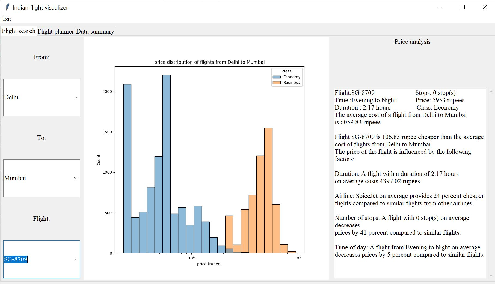
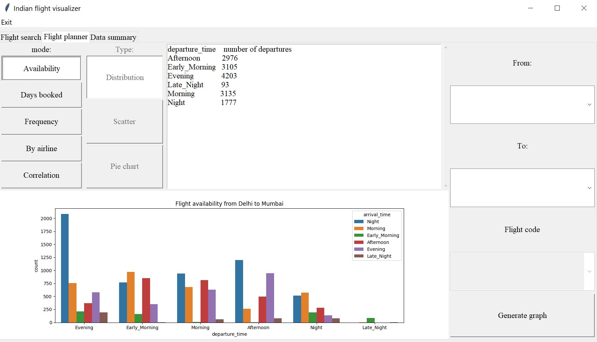
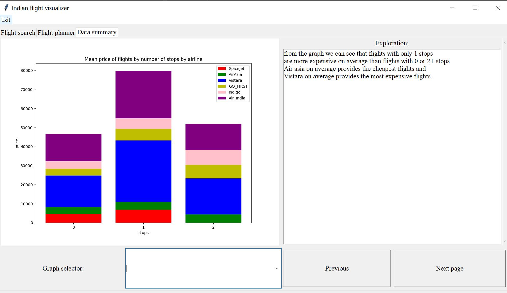

# Indian-flight-visualizer
A program to visualize flight data in the region of India

### description
A program that shows available flights from a pair of airports and
shows factors which affects flight price. As well as graphs of flight
price data to show the correlation between factors such as
Airline, number of stops and time of day on the price of the flight.

### screenshots
| Page                                         | Screenshot                      |
|----------------------------------------------|---------------------------------|
| Flight search                                |  |
| Flight planner                               |  |
| Data summary                                 |  |

### Installation
- clone the repository
```
https://github.com/KhunakornP/Indian-flight-visualizer.git
```
- navigate to the directory
```
cd Indian-flight-visualizer
```
#### See [Installation](https://github.com/KhunakornP/Indian-flight-visualizer/wiki/Installation-instructions) for more information
### How to run the program
1. Create a virtual environment (Optional)
```
python -m venv env
```
2. Activate the virtual environment (Skip if skipping step 1)
```
env/bin/activate

# on windows use
\env\Scripts\activate
```
3. Install dependencies
```
pip install -r requirements.txt
```
4. Run the program
```
python main.py
# the program will start after a few seconds
```
